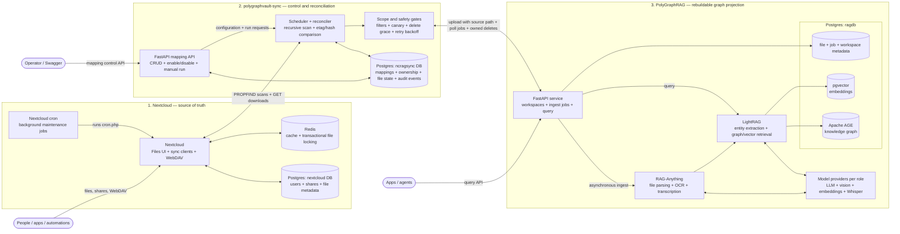

# PolyGraphVault

<p align="center">
  
</p>

**A self-hosted Nextcloud-to-knowledge-graph service** — keep documents in ordinary folders, continuously reconcile them into isolated [PolyGraphRAG](https://github.com/oleksandr-kushnir/polygraphrag) workspaces, and query both vector embeddings and an entity/relationship graph through a clean HTTP API.

<p>
  
  
  
  
  
  <a href="https://github.com/oleksandr-kushnir/polygraphvault/actions/workflows/ci.yml"></a>
  <a href="https://github.com/oleksandr-kushnir/polygraphvault/pkgs/container/polygraphvault-sync"></a>
  <a href="LICENSE"></a>
  <a href="https://www.linkedin.com/in/oleksandr-kushnir-ai/"></a>
</p>

PolyGraphVault packages [Nextcloud](https://nextcloud.com/files/), PolyGraphRAG, Postgres, Redis,
and a safety-aware FastAPI synchronizer into one deployable stack. It adds **runtime folder-to-graph
mappings**, **continuous file lifecycle reconciliation**, **exclusive workspace ownership**,
**guarded deletion**, and a queryable **audit trail**. Nextcloud remains the source of truth;
everything in the graph is a derived, rebuildable projection.

---

## 📂 A folder is the ingestion API

**No upload portal to teach. No watched host directory to mount. No parsing pipeline to wire up.**
People work through familiar folders and shares using official Nextcloud apps on their devices:

- 💻 [Desktop clients](https://nextcloud.com/install/#desktop-files) — Windows, macOS, and Linux
- 📱 [Mobile apps](https://nextcloud.com/install/#files-mobile) — Android and iOS

> 🖥️ Self-hosting? Follow the official
> [Nextcloud Server installation instructions](https://nextcloud.com/install/#instructions-server).

Automations write through WebDAV. The syncer discovers each accepted file, preserves its real path
for citations, and hands it to PolyGraphRAG for OCR, layout parsing, transcription, embeddings, and
entity/relationship extraction.

PDFs, Office documents, images, audio, Markdown, text, CSV, and HTML all enter through the same
folder workflow. Each mapping targets one exclusive PolyGraphRAG workspace, so client, case, or
project corpora remain isolated on one deployment.

Document parsing and OCR are powered by
[MinerU](https://github.com/opendatalab/MinerU) through PolyGraphRAG. MinerU is distributed under
the [MinerU Open Source License](https://github.com/opendatalab/MinerU/blob/master/LICENSE.md),
which requires visible attribution for online services based on it.

**One folder, one owned graph, one query surface.** A human can always open the original file an
answer cites, while an application can retrieve its graph-aware evidence over HTTP.

---

## 🔀🤖 The sync layer for n8n workflows and AI agents

**Pure HTTP, built for automators.** There is no SDK or client library to adopt. Both FastAPI
services expose Swagger UI and OpenAPI contracts, so an n8n HTTP Request node or tool-calling agent
can operate the complete flow:

- **Write** — send an email attachment, generated report, form upload, or agent note to Nextcloud
  with one WebDAV `PUT`.
- **Reconcile** — let `polygraphvault-sync` detect changes, poll asynchronous ingestion, retry
  failures with backoff, and safely retire stale graph documents.
- **Query** — call `POST /workspace/{id}/query` for an answer or
  `POST /workspace/{id}/query/data` for structured evidence without LLM prose.
- **Inspect** — read mapping state and audit events, or open the original Nextcloud document behind
  a citation.

Agents get durable, human-inspectable memory; workflows get multimodal GraphRAG without owning a
document-processing pipeline.

---

## Why it's interesting

- 🗂️ **Nextcloud is the source of truth.** Files stay browsable, shareable, versioned, and usable
  from standard desktop and mobile clients; the graph can always be rebuilt.
- 🕸️ **A real knowledge graph, not just chunks.** PolyGraphRAG stores embeddings in pgvector and
  entities/relationships in Apache AGE, then retrieves across both.
- 🔐 **Many sealed vaults on one stack.** Every mapping owns one workspace exclusively. The syncer
  never adopts or deletes documents it did not create.
- 🛡️ **Safe replacement and deletion.** Changed files are ingested before their previous graph
  documents are removed. Canary checks, minimum-file floors, bulk-drop limits, and healthy-scan
  grace periods stop an outage from becoming a mass deletion.
- 🧾 **Auditable and self-healing.** Ingests, replacements, deletes, retries, failures, and degraded
  scans are recorded; interrupted jobs can be recovered without duplicating documents.
- 🔌 **Provider-agnostic.** PolyGraphRAG independently routes extraction, query, vision, embeddings,
  and Whisper to OpenAI or compatible providers such as OpenRouter, Ollama, vLLM, and LM Studio.
- ⚙️ **Hardened for self-hosting.** Separate database roles, internal Compose networks, loopback
  backend ports, bearer auth, and a Caddy-only VPS edge keep the control plane private.

## Architecture



The numbered stacks show the ownership boundary. Nextcloud, its cron worker, and Redis maintain the
canonical file service. The syncer reads files only through WebDAV and records mapping, ownership,
retry, deletion, and audit state in its own database. PolyGraphRAG owns parsing and retrieval, with
RAG-Anything feeding LightRAG and each workspace isolated in pgvector and Apache AGE. All three
databases use one Postgres service but separate databases, roles, and Compose networks.

Each mapping binds one Nextcloud folder to one exclusive PolyGraphRAG workspace. On the VPS, Caddy
is the only public edge: it exposes Nextcloud and a token-protected query route, while the syncer
mapping API stays on loopback for SSH or VPN access.

## Requires Nextcloud and PolyGraphRAG to run

The syncer is a reconciliation service, not a standalone indexer. It needs Nextcloud WebDAV,
PolyGraphRAG, and Postgres to serve real mappings; `docker compose up` starts the complete stack.
Only the Python test suite runs without those services because it uses in-memory fakes.

---

## 🚀 Try it in five minutes

The working `.env` is intentionally git-ignored (it holds provider and local test credentials).
Clone, then:

```powershell
docker compose pull
docker compose build polygraphvault-sync
docker compose up -d
docker compose ps
```

Then open **`http://127.0.0.1:19630/settings`** — a single page linking to both interactive Swagger
consoles. The syncer's `/docs` is a full CRUD UI for mappings: every route has a "Try it out" button
that fires the real request.

Local endpoints (remapped in `.env` to coexist with other projects):

| Service | URL |
|---|---|
| **Settings entry point** | `http://127.0.0.1:19630/settings` |
| Syncer API / docs | `http://127.0.0.1:19630/docs` |
| PolyGraphRAG API / docs | `http://127.0.0.1:19622/docs` |
| Nextcloud UI | `http://127.0.0.1:18088` |
| Postgres | `127.0.0.1:15432` |

**Auth in one line:** the syncer API requires `Authorization: Bearer <SYNCER_API_TOKEN>` whenever
`SYNCER_API_TOKEN` is set (an empty token disables auth — fine for loopback dev only; the VPS
override refuses to start without one). PolyGraphRAG auth turns on when `POLYGRAPHRAG_API_TOKENS` is
non-empty. A single shared `API_TOKEN` in `.env` guards **both** services when their specific tokens
are left blank — one value locks everything down locally. Keep the two split on the VPS (see
[.env.vps.example](.env.vps.example)); they guard different privilege levels.

Read [the reviewed concept](docs/concept.md) and [security model](docs/security.md) before a VPS
deployment.

---

## 🗂️ Create your first mapping

Create the Nextcloud folder first, then create the mapping. `create_workspace=true` spins up a new,
empty, exclusively owned PolyGraphRAG workspace:

```powershell
$headers = @{ Authorization = "Bearer $env:SYNCER_API_TOKEN" }
$body = @{
  nextcloud_path      = "Knowledge/Customer Alpha"
  workspace_id        = "customer_alpha"
  workspace_name      = "Customer Alpha"
  create_workspace    = $true
  path_root           = "/nextcloud/sync-worker"
  include_extensions  = "md,txt,pdf,docx,pptx,xlsx"
  sync_hidden         = $false
  min_files           = 1
  max_delete_fraction = 0.25
} | ConvertTo-Json

Invoke-RestMethod http://127.0.0.1:19630/mappings `
  -Method Post -Headers $headers -ContentType application/json -Body $body
```

Everyday calls:

```powershell
Invoke-RestMethod http://127.0.0.1:19630/mappings -Headers $headers
Invoke-RestMethod http://127.0.0.1:19630/mappings/1/run -Method Post -Headers $headers
Invoke-RestMethod http://127.0.0.1:19630/mappings/1/disable -Method Post -Headers $headers
Invoke-RestMethod http://127.0.0.1:19630/mappings/1/enable -Method Post -Headers $headers
Invoke-RestMethod http://127.0.0.1:19630/mappings/1/state -Headers $headers
Invoke-RestMethod "http://127.0.0.1:19630/mappings/1/events?limit=50" -Headers $headers
```

Archiving a mapping retains its graph and ownership state; restore brings it back:

```powershell
Invoke-RestMethod http://127.0.0.1:19630/mappings/1 -Method Delete -Headers $headers
Invoke-RestMethod http://127.0.0.1:19630/mappings/1/restore -Method Post -Headers $headers
```

---

## 🧪 Persistent E2E spaces

The preparation script is idempotent and leaves its source folders, mappings, and workspaces in
place for manual use:

```powershell
.\scripts\prepare-persistent-e2e.ps1 `
  -NextcloudPassword $env:NEXTCLOUD_SYNC_PASSWORD `
  -SyncerToken $env:SYNCER_API_TOKEN
```

It creates:

- `Agent Operations Library` (`agent_operations_library`): nested Markdown + PDF + lifecycle file.
- `Visual Security Library` (`visual_security_library`): nested Markdown + real security diagram.
- `Audio Briefing Library` (`audio_briefing_library`): nested Markdown + spoken WAV briefing.

---

## 🌐 VPS deployment

Copy `.env.vps.example` to `.env`, replace every `change-me` value, point both DNS names at the
server, create the `/srv/polygraphvault/*` directories, and deploy:

```bash
docker compose -f docker-compose.yml -f docker-compose.vps.yml pull
docker compose -f docker-compose.yml -f docker-compose.vps.yml build polygraphvault-sync
docker compose -f docker-compose.yml -f docker-compose.vps.yml up -d
```

Caddy exposes only HTTPS Nextcloud and the token-protected PolyGraphRAG route. The mapping API stays
loopback-only; reach it through SSH forwarding or a private VPN. Follow every requirement in
[docs/security.md](docs/security.md), especially the non-admin Nextcloud service account, firewall,
backup, and token guidance.

---

## ✅ Tests

```powershell
docker run --rm -v "${PWD}\syncer:/src" -w /src `
  polygraphvault-sync `
  sh -c "pip install pytest==8.4.1 && python -m pytest -q"
```

The repository also validates local/VPS Compose rendering, Caddy configuration, upstream
PolyGraphRAG's mocked suite, live authentication, database-role isolation, recursive WebDAV
behavior, multiple real media types, graph isolation, queries, replacement, delete grace, and
restart recovery.

---

## 📄 License & third-party components

PolyGraphVault's own source — the **syncer** (`syncer/`) and the deployment configuration in this
repository — is released under the [MIT License](LICENSE).

PolyGraphVault is an *orchestration layer*. Its syncer image does not incorporate Nextcloud or
PolyGraphRAG libraries; Compose references separately distributed upstream images, and every image
and bundled dependency retains its own license:

| Component | Image | License |
|---|---|---|
| PolyGraphRAG API | `ghcr.io/oleksandr-kushnir/polygraphrag` | PolyGraphRAG code: MIT; bundled dependencies have separate licenses — see upstream [NOTICE](https://github.com/oleksandr-kushnir/polygraphrag/blob/main/NOTICE) and [inventory](https://github.com/oleksandr-kushnir/polygraphrag/blob/main/THIRD_PARTY_LICENSES.md) |
| PolyGraphRAG Postgres | `ghcr.io/oleksandr-kushnir/polygraphrag-postgres` | PostgreSQL License (PostgreSQL, pgvector) and Apache-2.0 (Apache AGE); see the upstream inventory |
| Nextcloud | `nextcloud:stable` | AGPL-3.0 |
| Redis | `redis:7-alpine` | BSD-3-Clause / RSALv2+SSPL (version-dependent) |
| Caddy | `caddy:2-alpine` | Apache-2.0 |

The PolyGraphRAG image includes RAG-Anything and LightRAG (MIT) and MinerU (the custom,
Apache-2.0-based MinerU Open Source License), plus a version-dependent transitive dependency tree.
Its upstream NOTICE and generated inventory are authoritative for the image build.

Merely referencing an upstream image in Compose is different from redistributing it. If you mirror,
export, bundle, modify, or otherwise redistribute an image, include its applicable notices and
comply with every bundled component's terms. Modified copyleft components such as Nextcloud may
also create source-disclosure obligations. This summary is not legal advice.
